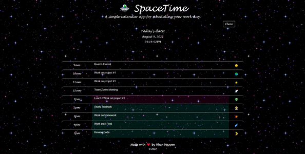

# 05_Work_Day__Scheduler_NN
BootCamp Homework - 05 Third-Party APIs: Work Day Scheduler
## The Challenge
Our client request us to create a simple calendar application that allows a user to save events for each hour of the day by modifying starter code. This app will run in the browser and feature dynamically updated HTML and CSS powered by jQuery. We'll need to use the Moment.js library to work with date and time. 




## User Story

```
AS AN employee with a busy schedule
I WANT to add important events to a daily planner
SO THAT I can manage my time effectively
```

## Acceptance Criteria

```
GIVEN I am using a daily planner to create a schedule
WHEN I open the planner
THEN the current day is displayed at the top of the calendar
WHEN I scroll down
THEN I am presented with timeblocks for standard business hours
WHEN I view the timeblocks for that day
THEN each timeblock is color coded to indicate whether it is in the past, present, or future
WHEN I click into a timeblock
THEN I can enter an event
WHEN I click the save button for that timeblock
THEN the text for that event is saved in local storage
WHEN I refresh the page
THEN the saved events persist
``` 

## The Process
To satisfy our client's needs, we had to:
- Creat an HTML file that imports JS Moment library, Bootstrap, CSS, and JavaScript
- Provide a space theme with our CSS file
- Create a JavaScript file that stores users' input in local storage
- Modify HTML file to dynamically work with JavaScript file and CSS file

HTML File

```
Link the following files/library:
CSS file, Boostrap Library, Font Awesome Library, Javascript File, Moment, and jQuery Library
```

CSS File

```
Use galaxy gif as background image to add space theme
Change font style
Change box's coloring
```
Specific functions in JavaScript file

Save input in local storage:

```javascript
for (let i = 0; i < boxes.length && entries.length; i++) {
boxes[i].val(localStorage.getItem(entries[i]));
};
```

Add current's date to jumbotron

```javascript
function tick() {
dayEl.text(moment().format('LL'));
timeEl.text(moment().format('hh:mm:ssA'));
$('.jumbotron').append(dayEl);
$('.jumbotron').append(timeEl);
}
tick();
```

Change box's color depending on current time using for loop

```javascript
function checkTime() { 
    for (let i = 0; i < boxes.length; i++) {
        if (parseInt(boxes[i].attr('data-hour')) > timeNow) {
        boxes[i].removeClass('past present future');
        boxes[i].addClass('future');
        } else if (parseInt(boxes[i].attr('data-hour')) === timeNow) {
        boxes[i].removeClass('past present future');
        boxes[i].addClass('present');
        } else {
        boxes[i].removeClass('past present future');
        boxes[i].addClass('past');
}}};
```

Store individual box's input in local storage using for loop

```javascript
for (let i = 0; i < buttons.length; i++)
buttons[i].on('click', function() {
    event.preventDefault(); 
    for (let i = 0; i < boxes.length && entries.length; i++) {    
    if (boxes[i].val() !== '') {
    localStorage.setItem(entries[i], boxes[i].val());
}}});
```


## The Result
After importing bootstrap, jQuery, and Moment to our HTML file along with dynamically coding Javascript and  refractoring CSS, we were able to provide a clean, interactive, and functional schedule planner. 

## Submission
This project was uploaded to GitHub at the following repository link:
[https://github.com/nhanng19/spacetime_schedule](https://github.com/nhanng19/spacetime_schedule)

Deployed Web Application Link:
[https://nhanng19.github.io/spacetime_schedule/](https://nhanng19.github.io/spacetime_schedule/)
